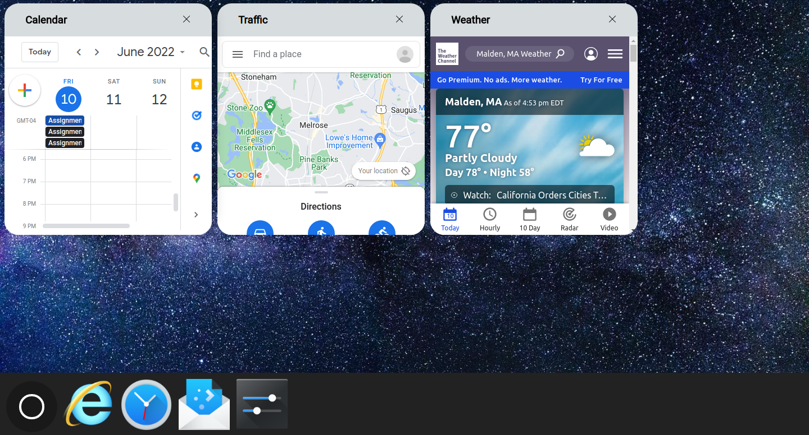
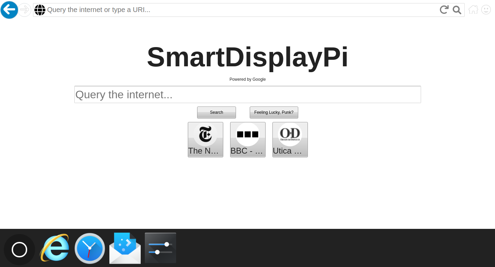
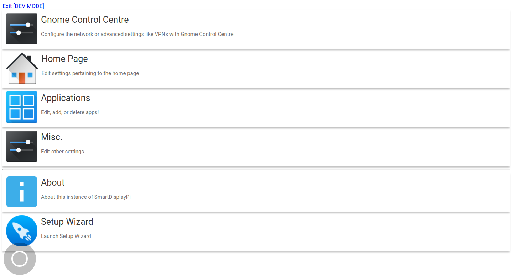

# SmartDisplayPi
An awesome smart display powered by Google Assistant and Raspberry Pi.
## Features

* <s>Google Assistant</s> Not yet!
* Main page widgets
* Built-in browser
* Built-in onscreen keyboard
* Custom apps
* Auto-ambient mode
* Settings page

## Screenshots!



## Required:
* Raspberry Pi 3B or newer (At *least* 1GB of memory)
* *Minimum* 8GB SD card
* Internet connection

## Installation guide:
[Install Ubuntu 21.10](https://ubuntu.com/download/raspberry-pi/thank-you?version=21.10&architecture=server-arm64+raspi) and then run:
```bash
cd ~/ && wget https://tinyurl.com/installsmartdisplay -O install.sh && chmod +x install.sh && ./install.sh stable
```
### Beta [male] testing
[Install Ubuntu 21.10](https://ubuntu.com/download/raspberry-pi/thank-you?version=21.10&architecture=server-arm64+raspi) and then run:
```bash
cd ~/ && wget https://tinyurl.com/installsmartdisplay -O install.sh && chmod +x install.sh && ./install.sh beta
```
### Alpha [male] testing
[Install Ubuntu 21.10](https://ubuntu.com/download/raspberry-pi/thank-you?version=21.10&architecture=server-arm64+raspi) and then run:
```bash
cd ~/ && wget https://tinyurl.com/installsmartdisplay -O install.sh && chmod +x install.sh && ./install.sh alpha
```
## Contributing
Pull requests are welcome. For major changes, please open an issue first to discuss what you would like to change. Any help or feedback will greatly be appreciated.

## Further Development
In the near future, we would love to see SmartDisplayPi support Google Assistant!
## License
[MIT](https://choosealicense.com/licenses/mit/)
